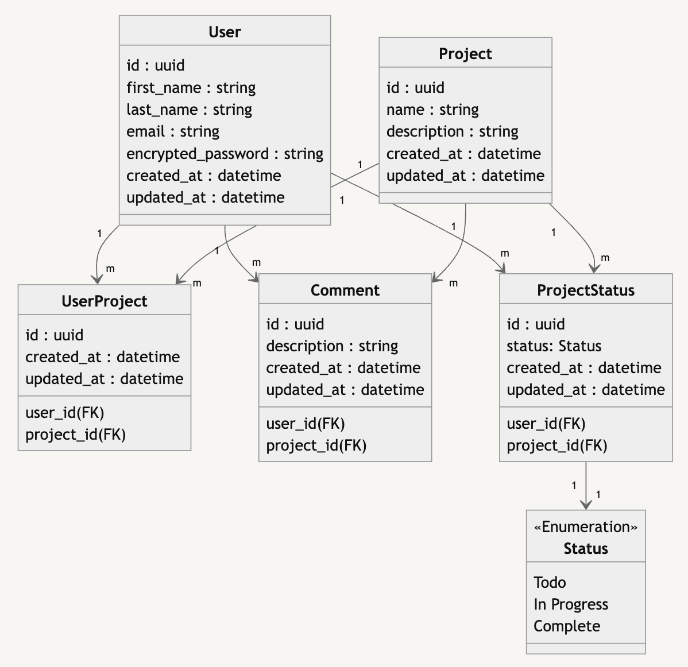
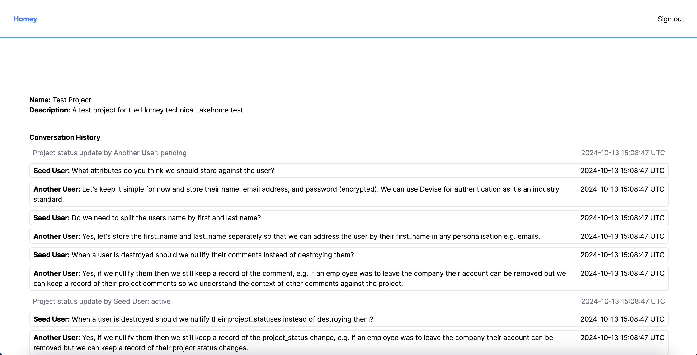

**Table of Contents**

- [Task](#task)
- [Brief](#brief)
- [Prerequisites](#prerequisites)
- [Getting Started](#getting-started)
- [Deployed URL](#deployed-url)
- [Logging in and navigating to the Conversation History](#logging-in-and-navigating-to-the-conversation-history)
- [Database ERD](#database-erd)
- [Example Project Conversation History](#example-project-conversation-history)
- [If this were a Production application](#if-this-were-a-production-application)

## Task

Use Ruby on Rails to build a project conversation history. A user should be able to:

- leave a comment
- change the status of the project

The project conversation history should list comments and changes in status.

Please don’t spend any more than 3 hours on this task.

## Brief

Treat this as if this was the only information given to you by a team member, and take the approach you would normally take in order to build the right product for the company.

To this extent:

- Please write down the questions you would have asked your colleagues
- Include answers that you might expect from them
- Then build a project conversation based on the answers to the questions you raised.

## Prerequisites

Ruby version: 3.3.1

Rails version: 7.1.4

## Getting Started

Install dependencies

```bash
bundle install
```

Setup database:

```bash
rails db:create db:migrate db:seed
```

Run the tests:

```bash
rails test
```

## Deployed URL

| Link       | URL                                                                  |
| ---------- | -------------------------------------------------------------------- |
| Production | [https://homey-v3fw.onrender.com/](https://homey-v3fw.onrender.com/) |

## Logging in and navigating to the Conversation History

The application uses [Devise](https://github.com/heartcombo/devise) for authentication.

A seed user has been added to the `db/seeds.rb` file with login credentials as follows:

**Email:** `seed@example.com`  
**Password:** `Seed123`

Once logged in use the 'Show this project' button to view the Seed Project named 'Test Project'.

## Database ERD



## Example Project Conversation History



## If this were a Production application

If this were a Production application instead of a technical test I would:

- spend more time on the UI design and the UX
- enable adding and removing comments
- enable editing comments
- display the current project status at the top of the page
- display the datetime of the project_status updates and comments in a more user friendly way using [`strftime`](https://apidock.com/ruby/DateTime/strftime)
